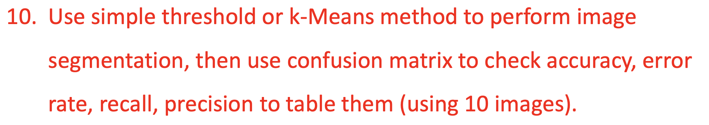
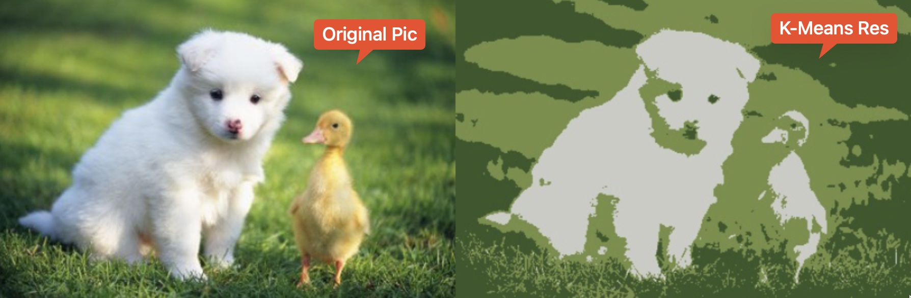
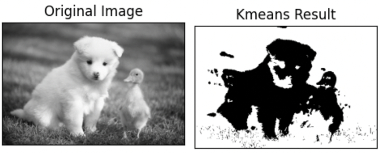
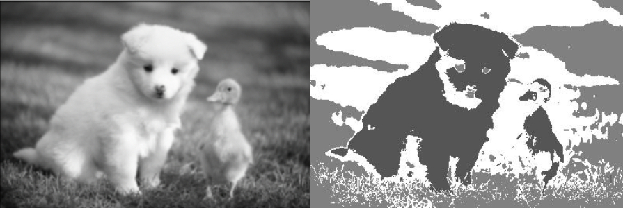

# DMDK1001_Group_Project

Data Mining and Knowledge Discovery (1001) Group Project

## 1. Project Question



---

## 2. Using Package

- NumPy

- Opencv-python

- Matplotlib

---

## 3. Install Project

```python
git clone (project repo name)
conda create -n md python=3.7
conda activate md
pip install -r requirements.txt
```

---

## 4. Using Project

### 4.1 Using cv2 Kmeans Method

```python
python main.py --img (str) --clustersNum (int)

# Easy Example
python main.py
```

### 4.2 Using Our Numpy-made Kmeans Methods

```python
python run.py --img (str) --clustersNum (int)

# Easy Example
python run.py
```

### 4.3 Using Sklearn Kmeans Method

```python
python sklearn_kmeans.py
```

---

## 5. Example Result

### 5.1 cv2 Kmeans Method Result (3 clusters)



### 5.2 Ours Restult (2 clusters)



### 5.3 Sklearn Kmeans Result (3 clusters)



---

## 6. Acknowledgement

The implementation took reference from [Opencv K-Means Clusters]([K-Means Clustering in OpenCV &mdash; OpenCV-Python Tutorials beta documentation](https://opencv24-python-tutorials.readthedocs.io/en/latest/py_tutorials/py_ml/py_kmeans/py_kmeans_opencv/py_kmeans_opencv.html#kmeans-opencv)), [Numpy](https://numpy.org/), [Sklearn]([sklearn.cluster.KMeans &mdash; scikit-learn 1.1.3 documentation](https://scikit-learn.org/stable/modules/generated/sklearn.cluster.KMeans.html))

We thank the authors for their generosity to release code.
